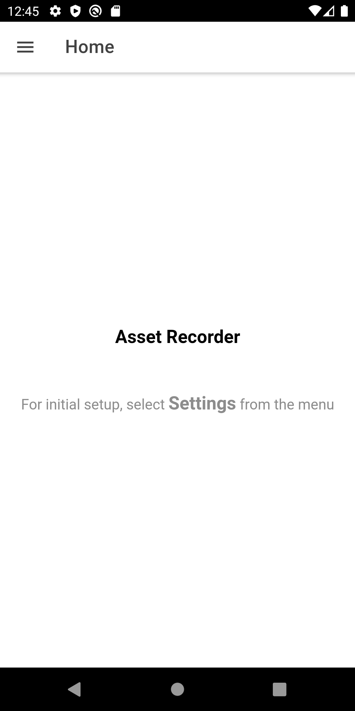
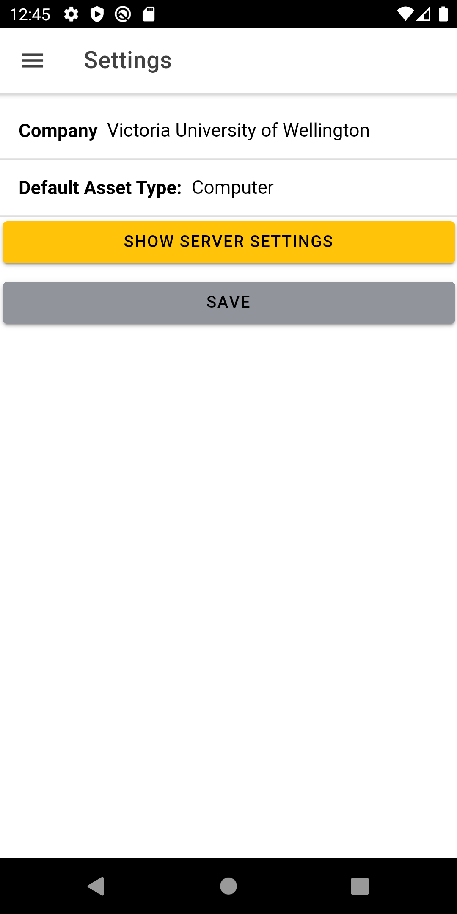
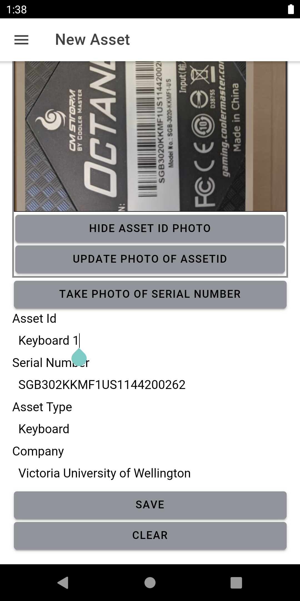
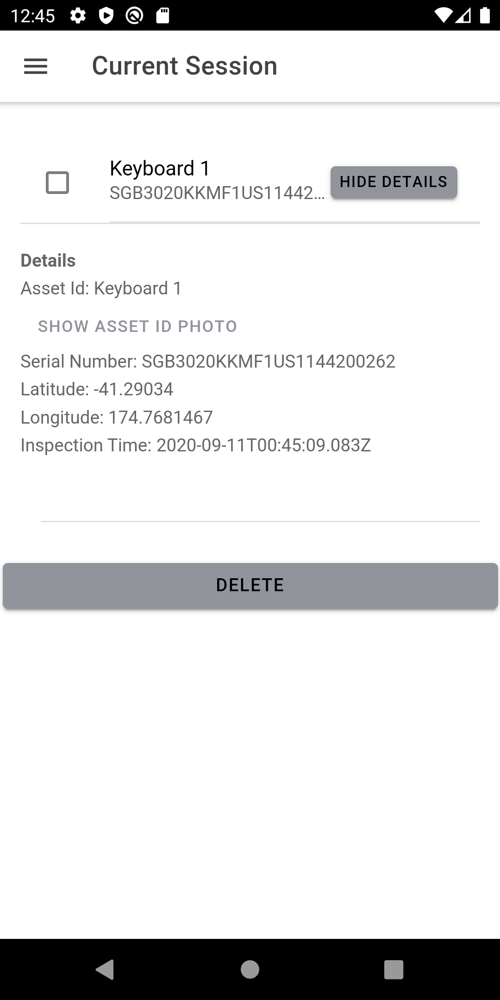
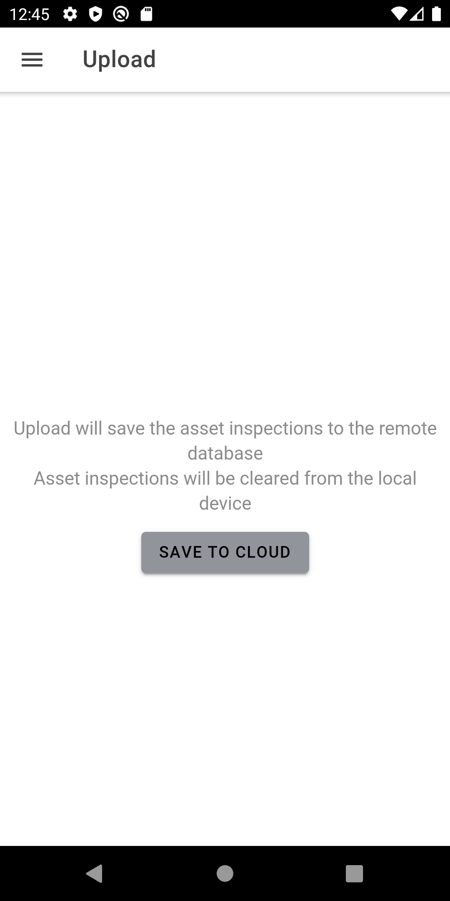
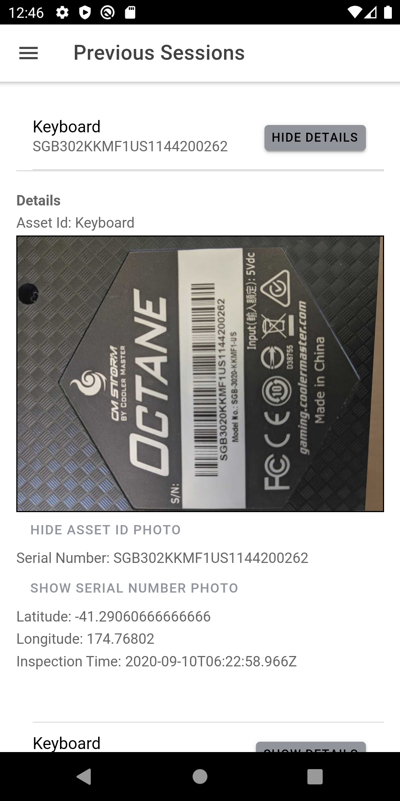

# Asset Inspection Mobile App
## Background
The asset inspection mobile app was created as a university project for Software Development for Mobile Platforms.

Asset management is a way to track and document assets owned by a company/organisation. Many organisations do not do asset management because it is expensive/time consuming. Manual asset data entry is not uncommon and has many potential problems, these include
+ problems with data entry (mistyped barcodes etc)
+ interrupting work while details are recovered from the assets on site
+ large amounts of time for each asset

## Vison
1. App concept: A mobile device application that uses attached sensors (GPS, Camera) to capture information about an asset and make the manual process of taking asset information much quicker and easier.
2. Key Features: GPS information taken for the assets, time and date of the asset inspection, photos of key points of information for the asset (Asset barcode/Serial number, model number, general appearance), saving assets to the cloud.

## Description
The app acts as a handset to capture information about assets, able to review details, delete incorrect inspections, upload completed inspections and review existing inspections.
The aim of the app is not to act as an asset management tool, but as a handset to capture inspection information quickly and easily.

## Screenshots

